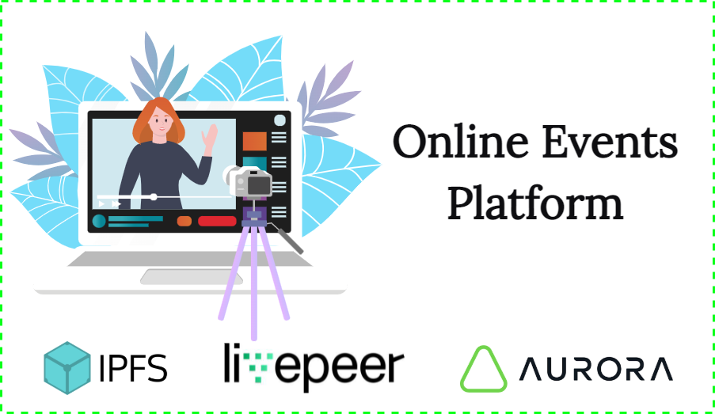

# OnlineEventsPlatform

Online Event Platform is a dApp deployed on the Aurora EVM chain where the platform organizer can host multiple online events with some options, one of which is an option that allows to watch the live stream of event only those users who have a special pass - "NFT Events Pass" . At the moment, this pass can be minted on dapp for free.

### Demonstration:

1. Website live: TBD
2. Video demo: TBD

### DApp features:

- TBD
- TBD

### How to deploy dApp:

1. Clone this repository.
2. Go to <ins>scripts</ins> folder and open <ins>config.js</ins> file.
3. Set all constants like `OWNER`, `EVENTS_CONTRACT_ADDRESS`, `EVENTS_CONTRACT_ABI` and others...

### Screens:

